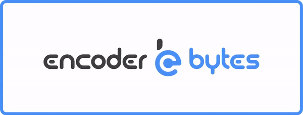
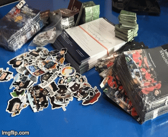
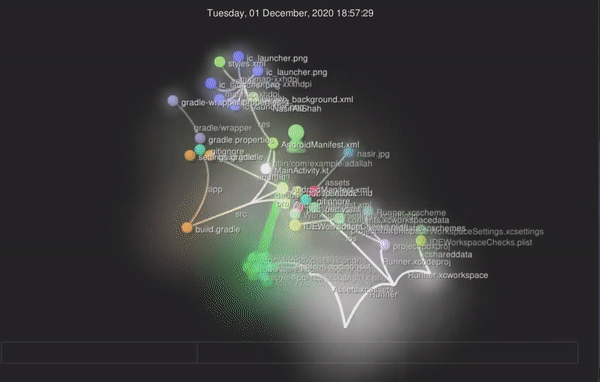

  

 
<h1>Happy to see you here</h1> The green dots on my GitHub represent my journey :running_man: - I’m the Founder and CEO of Encoderbytes Pvt Ltd and I enjoy building high quality software products and services across the globe. Moreover, I’m a computer scientist, software engineer by profession and entrepreneur by passion. 
 
My Work Experience:
✅ Product Development, Market Research, Building UI/UX strategies with the creative and development teams.
✅Solution Architecting for the products 

• Application Development and Managing development team.
✅Revenue Optimization and Cost Benefit Analysis for new and ongoing projects.
✅ Product Desging
✅ Project Management / Scrum Master
✅ Mentoring and coaching
✅ Mobile Application Development ( Native IOS, Native Android, Flutter and React Native )
✅ Full-Stack Web Development ( MERN Stack, MEAN Stack, PERN Stack, ReactJS, NextJS, VueJS, NodeJS)
✅Blockchain ( Ethereum, Solana, Flow ) 
✅ Data Science ( Collecting real time Data from data source and API, Data Cleaning and Preprocessing, Data Visualization to get Insights of Data)
✅ Machine Learning & Deep Learning

Community Services:
✅ Worked for Transgender and Women in uplifting their rights in the society.
✅ Provided Sessions and training on Computer & Digital skills to madrassah students.
✅ Training Sessions on Business and Entrepreneurship strategies and building up profiles for earning. 
✅ Provided sessions and Practical training on freelancing platforms in Mobile Apps development, Website development, Data Science, and machine learning.

Educational Services:
✅ Working as Youth Activist of STEM Education in providing AI, Coding and App Development sessions for kids (Age 13-18).
✅ Training Sessions on Business and Entrepreneurship strategies and building up profiles for earning. 
✅ Training Sessions as a Counsellor and Motivational speaker to assist Career Development strategies.

Email:
jawad@encoderbytes.com

**Languages and Tools:**  

<code></code>
<code></code>
<code></code>
<code></code>
<code></code>
<code></code>
<code></code>
<code></code>
<code></code>

  
  

---

  
  

---

#### Blogs on [Medium](https://medium.com/@MianJawadAhmad):

####

Outside of [GitHub](https://github.com/mianjawadahmad/), You can **find me. Currently I'm **free to contribute**

  
  
  
  

<a href="https://encoderbytes.com">🌐 Check out my website</a>

<!--
**MianJawadAhmad/MianJawadAhmad** is a ✨ _special_ ✨ repository because its `README.md` (this file) appears on your GitHub profile.

Here are some ideas to get you started:

- 🔭 I’m currently working on ...
- 🌱 I’m currently learning ...
- 👯 I’m looking to collaborate on ...
- 🤔 I’m looking for help with ...
- 💬 Ask me about ...
- 📫 How to reach me: ...
- 😄 Pronouns: ...
- ⚡ Fun fact: ...
-->
